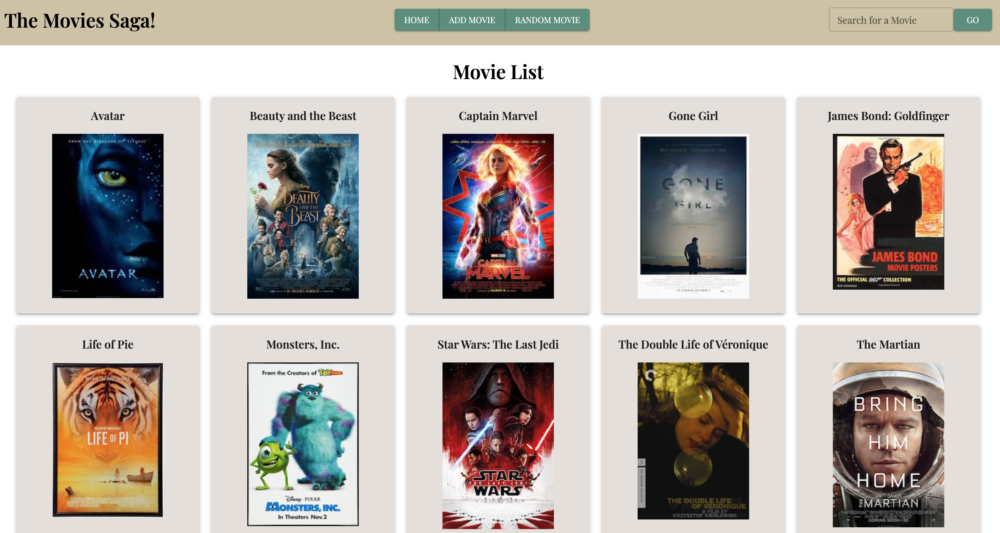
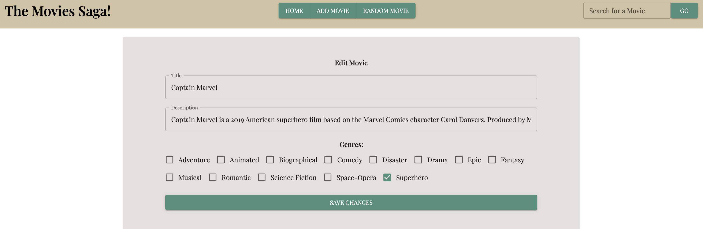

# Movie Sagas

## Description

_Duration: Weekend Assignment_

The prompt for this project was to create a full stack application that allows a user to view a list of movies and update their information in a variety of ways.

## Screen Shots

## Installation

1. Create a database named saga_movies_weekend
2. The queries in database.sql are set up to create the necessary table and populate it with some dummy data. The project is built on Postgres, so you will need to make sure to have that installed.
3. Open up your editor of choice and run `npm install`
4. Run `npm run server` in your terminal
5. Run `npm run client` in another terminal. This should open up a new browser tab.

## User Stories

1. A user can view a list of movies and their posters on a home page.
2. A user can search for movies by keyword, and movies that contain those keywords in their titles or descriptions will appear in the search.
3. A user can click on movies from the main page to view more information, including the movie description and a list of genres for the movie.
4. A user can edit movie information by clicking an edit button. They are taken to a new page where they can change a movie's title, description, and genres.
5. A user can delete a movie from the database
6. A user can add a new movie by entering a title, image path, description, and appropriate genres.
7. A user can go to a random movie details page by clicking the "random movie button."

## Technologies used

- Node.js
- React.js
- Axios.js
- Express
- PostGres
- PostGreSQL and SQL Joins
- React Redux
- Redux SAGAS
- Material UI
- Material UI Themes

## Acknowledgement

- Thanks to Prime Digital Academy, my Amethyst cohort, and instructors Dane, Key, and Edan.
